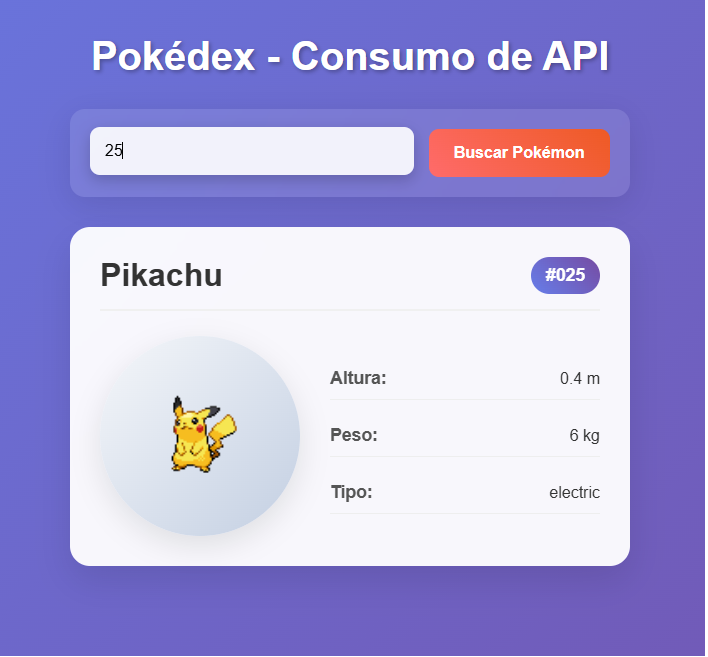

# Pokédex - Consumo de API com JavaScript

Um projeto simples para demonstrar como consumir APIs usando JavaScript vanilla e a Fetch API.

## 🎯 O que faz

Busca informações de Pokémon na PokéAPI e exibe em um card bonito com:
- Nome e número do Pokémon
- Imagem (sprite)
- Altura, peso e tipos

## 🛠 Tecnologias

- HTML5
- CSS3
- JavaScript (Fetch API)
- PokéAPI

## 🚀 Como usar

1. Clone o repositório
2. Abra o arquivo `index.html` no navegador
3. Digite o nome ou número de um Pokémon
4. Clique em "Buscar Pokémon"

## 📁 Arquivos

- `index.html` - Estrutura da página
- `style.css` - Estilos e layout
- `script.js` - Lógica JavaScript

## 🌐 API

Utiliza a [PokéAPI](https://pokeapi.co/) - uma API gratuita com dados de Pokémon.

---

Projeto educacional para aprender consumo de APIs com JavaScript!